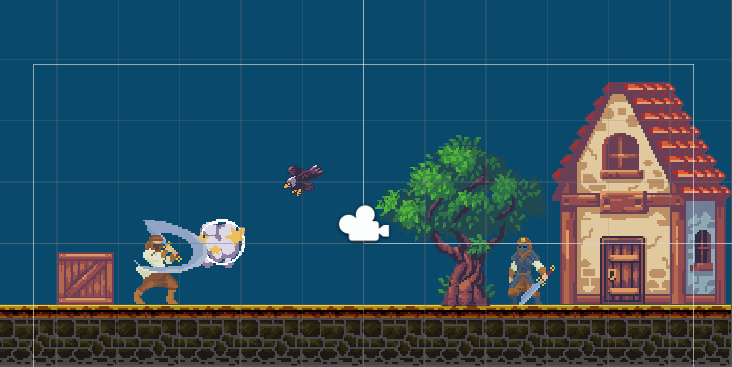

# A Cautious Adventure

> A short 2d side scroller.
> Live demo [NA](https://www.example.com). <!-- If you have the project hosted somewhere, include the link here. -->

## Table of Contents

* [General Info](#general-information)
* [Technologies Used](#technologies-used)
* [Features](#features)
* [Screenshots](#screenshots)
* [Setup](#setup)
* [Usage](#usage)
* [Project Status](#project-status)
* [Room for Improvement](#room-for-improvement)
* [Acknowledgements](#acknowledgements)
* [Contact](#contact)
* [License](#license)

## General Information

* 2D side scroller game in which you're a medieval warrior trying to get home. Consists of a single level.
* Character will move horizontally usin the left/right arrows keys.
* Character will be able to duck using the down key.
* Character will be able to jump using the space bar.
* Character will be able to attack using F key.

## Technologies Used

* C#
* Unity 2019
* Visual Studio 2019

## Screenshots

## Setup

NA

## Project Status

Project is: _in progress_

## Room for Improvement

* Multiple Levels.
* Respawning Enemies.
* A health bar for the protagonist.

## Acknowledgements

## Contact

Created by [Joshua Haddock](https://www.linkedin.com/in/joshuahaddock/) - feel free to contact me!

## License

This project is open source and available under the [MIT License](./LICENSE).
